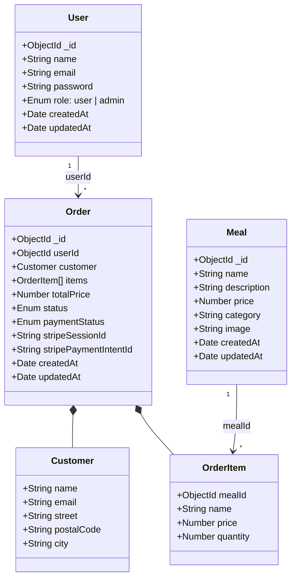
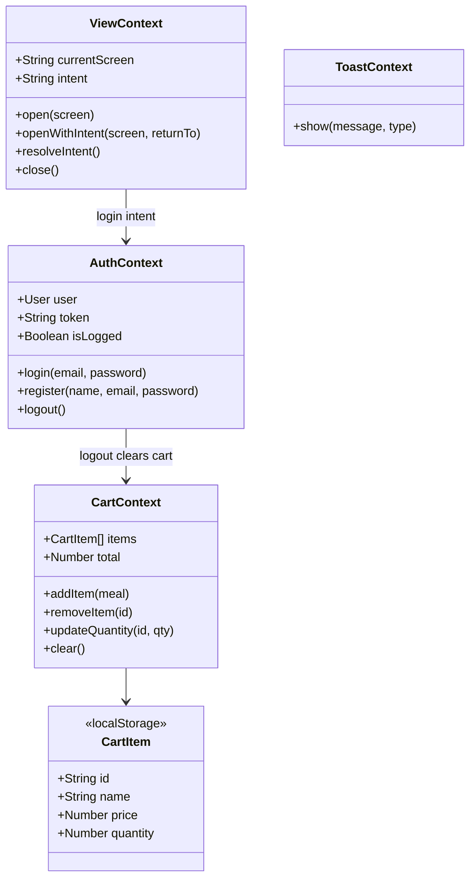
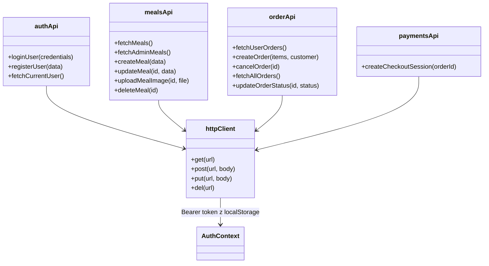

# Diagram klas

## Modele Mongoose (backend)

```mermaid
classDiagram
    class User {
        +ObjectId _id
        +String name
        +String email
        +String password
        +Enum role: user | admin
        +Date createdAt
        +Date updatedAt
    }

    class Meal {
        +ObjectId _id
        +String name
        +String description
        +Number price
        +String category
        +String image
        +Date createdAt
        +Date updatedAt
    }

    class Order {
        +ObjectId _id
        +ObjectId userId
        +Customer customer
        +OrderItem[] items
        +Number totalPrice
        +Enum status
        +Enum paymentStatus
        +String stripeSessionId
        +String stripePaymentIntentId
        +Date createdAt
        +Date updatedAt
    }

    class Customer {
        +String name
        +String email
        +String street
        +String postalCode
        +String city
    }

    class OrderItem {
        +ObjectId mealId
        +String name
        +Number price
        +Number quantity
    }

    User "1" --> "*" Order : userId
    Order *-- Customer
    Order *-- OrderItem
    Meal "1" --> "*" OrderItem : mealId
```

## Konteksty React (frontend)

```mermaid
classDiagram
    class AuthContext {
        +User user
        +String token
        +Boolean isLogged
        +login(email, password)
        +register(name, email, password)
        +logout()
    }

    class CartContext {
        +CartItem[] items
        +Number total
        +addItem(meal)
        +removeItem(id)
        +updateQuantity(id, qty)
        +clear()
    }

    class ViewContext {
        +String currentScreen
        +String intent
        +open(screen)
        +openWithIntent(screen, returnTo)
        +resolveIntent()
        +close()
    }

    class ToastContext {
        +show(message, type)
    }

    class CartItem {
        <<localStorage>>
        +String id
        +String name
        +Number price
        +Number quantity
    }

    CartContext --> CartItem
    AuthContext --> CartContext : logout clears cart
    ViewContext --> AuthContext : login intent
```

Providerzy zagnieżdżone w `App.jsx`: Toast → Auth → View → Cart.

## Warstwa API (frontend)

```mermaid
classDiagram
    class httpClient {
        +get(url)
        +post(url, body)
        +put(url, body)
        +del(url)
    }

    class authApi {
        +loginUser(credentials)
        +registerUser(data)
        +fetchCurrentUser()
    }

    class mealsApi {
        +fetchMeals()
        +fetchAdminMeals()
        +createMeal(data)
        +updateMeal(id, data)
        +uploadMealImage(id, file)
        +deleteMeal(id)
    }

    class orderApi {
        +fetchUserOrders()
        +createOrder(items, customer)
        +cancelOrder(id)
        +fetchAllOrders()
        +updateOrderStatus(id, status)
    }

    class paymentsApi {
        +createCheckoutSession(orderId)
    }

    authApi --> httpClient
    mealsApi --> httpClient
    orderApi --> httpClient
    paymentsApi --> httpClient
    httpClient --> AuthContext : Bearer token z localStorage
```
