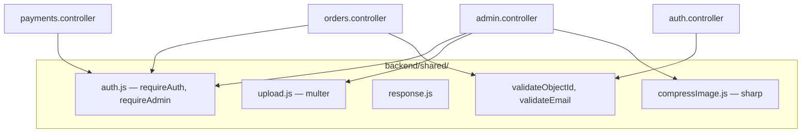

# Diagram komponentów

Mapowanie modułów `features/` między frontendem a backendem

```mermaid
flowchart LR
    subgraph FE["Frontend features/"]
        F_AUTH[auth]
        F_CART[cart]
        F_MEALS[meals]
        F_ORDERS[orders]
        F_ADMIN[admin]
        F_PAY[payments]
    end

    subgraph API["Backend /api"]
        B_AUTH[/auth]
        B_MEALS[/meals]
        B_ORDERS[/orders]
        B_ADMIN[/admin]
        B_PAY[/payments]
    end

    F_AUTH --> B_AUTH
    F_MEALS --> B_MEALS
    F_MEALS --> B_ADMIN
    F_ORDERS --> B_ORDERS
    F_ORDERS --> B_ADMIN
    F_ADMIN --> B_ADMIN
    F_PAY --> B_PAY
    F_CART -.->|tylko localStorage| F_ORDERS
```

## Szczegóły modułów

### auth

| Frontend                    | Backend                                         |
| --------------------------- | ----------------------------------------------- |
| `LoginView`, `RegisterView` | `POST /register`, `POST /login`, `GET /current` |
| `AuthContext`               | `User.model`, JWT middleware                    |

### meals

| Frontend                                      | Backend                                                          |
| --------------------------------------------- | ---------------------------------------------------------------- |
| `MealsList`, `MealItem`                       | `GET /meals` (publiczne)                                         |
| `MealAdminView`, `MealForm`, `MealCreateView` | `GET/POST/PUT/DELETE /admin/meals`, `PUT /admin/meals/:id/image` |

### cart

| Frontend               | Backend                                          |
| ---------------------- | ------------------------------------------------ |
| `CartView`, `CartItem` | — (brak endpointu, `CartContext` + localStorage) |

### orders

| Frontend                        | Backend                                             |
| ------------------------------- | --------------------------------------------------- |
| `CheckoutView`                  | `POST /orders`                                      |
| `OrdersView`, `ClientOrderItem` | `GET /orders`, `PUT /orders/:id/cancel`             |
| `AdminOrderItem`                | `GET /admin/orders`, `PUT /admin/orders/:id/status` |

### payments

| Frontend    | Backend                                     |
| ----------- | ------------------------------------------- |
| `PayButton` | `POST /payments/checkout/:orderId`          |
| —           | `POST /payments/webhook` (Stripe → backend) |

## Backend — współdzielone


