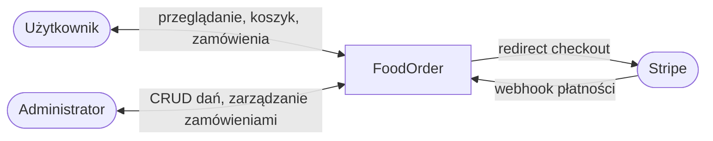
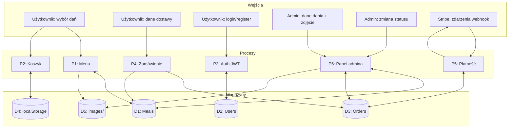

# Przepływ danych (DFD)

## Poziom 0 — kontekst systemu



## Poziom 1 — procesy i magazyny



## Przepływ zamówienia (skrót)

1. **Menu** — `GET /api/meals` → odczyt `D1`.
2. **Koszyk** — zapis w `D4`, bez backendu.
3. **Checkout** — `POST /api/orders` → zapis w `D3` (snapshot pozycji z `D1`).
4. **Płatność** — `POST /api/payments/checkout/:id` → Stripe → webhook → aktualizacja `paymentStatus` w `D3`.

## Format odpowiedzi API

Wszystkie endpointy zwracają envelope:

```json
{
  "success": true,
  "data": {},
  "message": "..."
}
```

`httpClient` na frontendzie rozpakowuje pole `data`.
