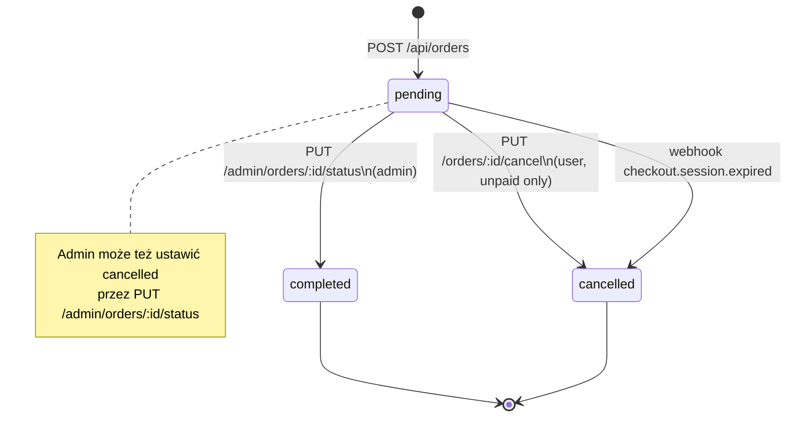
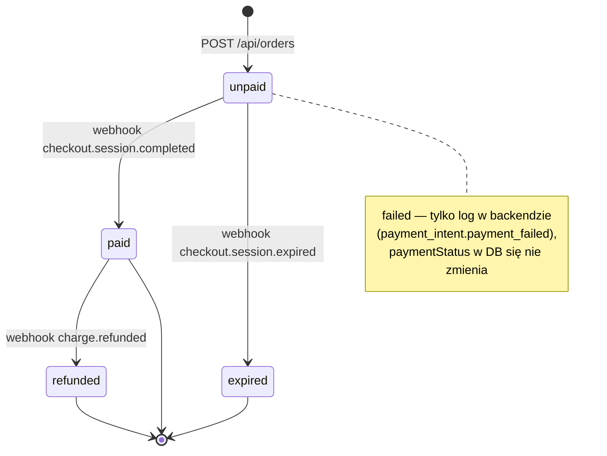
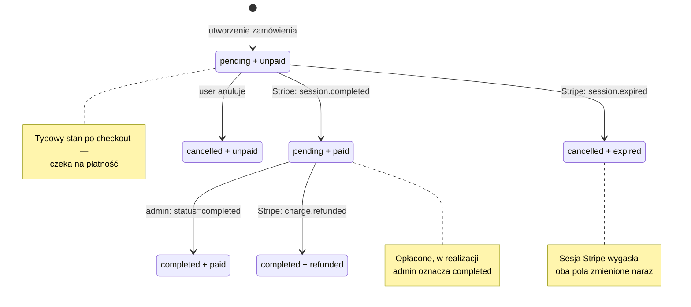

# Stany zamówienia

Zamówienie ma **dwa niezależne wymiary** stanu:

| Pole            | Wartości                                          | Kto zmienia                                 |
| --------------- | ------------------------------------------------- | ------------------------------------------- |
| `status`        | `pending`, `completed`, `cancelled`               | user (anulowanie), admin, webhook (expired) |
| `paymentStatus` | `unpaid`, `paid`, `failed`, `expired`, `refunded` | Stripe webhook                              |

Przy tworzeniu: `status: pending`, `paymentStatus: unpaid`.

---

## status — realizacja zamówienia

**Warunki anulowania przez użytkownika** (`cancelOrder`):

- `status === 'pending'`
- `paymentStatus === 'unpaid'`
- zamówienie należy do zalogowanego usera

---

## paymentStatus — płatność

Webhook `checkout.session.expired` ustawia jednocześnie `paymentStatus: expired` **i** `status: cancelled`.

---

## Diagram współbieżny (kombinacje stanów)

## Tabela kombinacji

| status      | paymentStatus | Znaczenie                     | Typowy następny krok |
| ----------- | ------------- | ----------------------------- | -------------------- |
| `pending`   | `unpaid`      | Nowe zamówienie               | Zapłać lub anuluj    |
| `pending`   | `paid`        | Opłacone, czeka na realizację | Admin → `completed`  |
| `completed` | `paid`        | Zrealizowane i opłacone       | —                    |
| `cancelled` | `unpaid`      | Anulowane przed płatnością    | —                    |
| `cancelled` | `expired`     | Sesja Stripe wygasła          | —                    |
| `completed` | `refunded`    | Zwrot po realizacji           | —                    |
