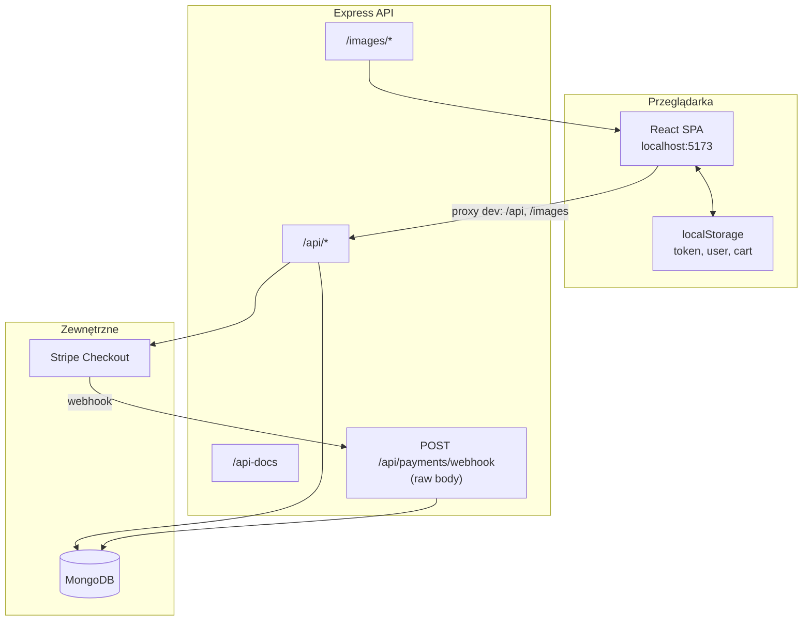

# Przegląd architektury

Monorepo: dwa niezależne pakiety (`frontend/`, `backend/`), bez wspólnego root `package.json`.

## Diagram wdrożenia

## Warstwy

| Warstwa          | Lokalizacja                                  | Odpowiedzialność                            |
| ---------------- | -------------------------------------------- | ------------------------------------------- |
| **UI**           | `frontend/src/features/`, `frontend/src/ui/` | Widoki, formularze, koszyk                  |
| **Stan klienta** | `frontend/src/app/context/`                  | Auth, cart, nawigacja, toasty               |
| **API client**   | `frontend/src/shared/api/`                   | `fetch` + JWT w nagłówku                    |
| **Routing**      | `ViewContext`                                | Overlay widoków — bez React Router          |
| **API**          | `backend/features/`                          | Kontrolery, trasy, logika domenowa          |
| **Middleware**   | `backend/shared/middleware/`                 | JWT (`requireAuth`, `requireAdmin`), upload |
| **Persystencja** | Mongoose                                     | `User`, `Meal`, `Order`                     |
| **Płatności**    | `backend/features/payments/`                 | Stripe session + webhook                    |
| **Pliki**        | `backend/images/`                            | Zdjęcia dań (webp 400/600/800)              |

## Komunikacja dev

Vite (`vite.config.js`) proxy:

- `/api` → `http://localhost:3000`
- `/images` → `http://localhost:3000`

Produkcja wymaga osobnej konfiguracji reverse proxy lub `VITE_API_URL`.

## Kluczowe decyzje

- **Koszyk tylko w przeglądarce** — synchronizacja z backendem dopiero przy `POST /api/orders`.
- **Pozycje zamówienia denormalizowane** — `name` i `price` kopiowane z `Meal` w momencie składania.
- **Dwa wymiary stanu zamówienia** — `status` (realizacja) i `paymentStatus` (płatność) działają niezależnie. Szczegóły: [order-states.md](order-states.md).
