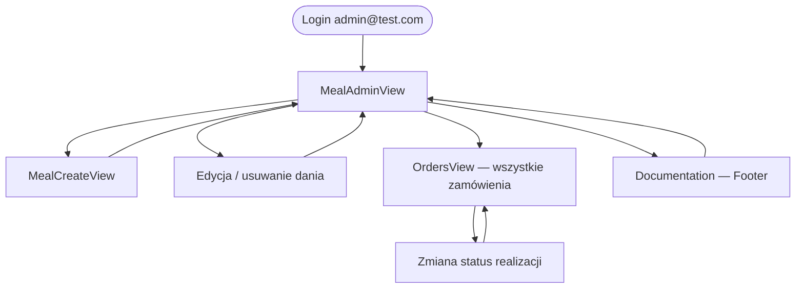
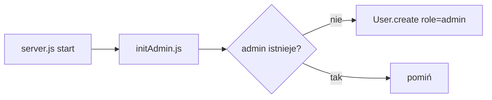

# Ścieżka administratora

## Różnice vs użytkownik

| Aspekt                    | User                 | Admin                           |
| ------------------------- | -------------------- | ------------------------------- |
| Domyślny widok po loginie | `MealsList` + koszyk | `MealAdminView` (przycisk Menu) |
| Koszyk                    | widoczny             | ukryty                          |
| `OrdersView`              | własne zamówienia    | wszystkie + dane klienta        |
| Zarządzanie daniami       | brak                 | pełny CRUD + upload             |
| Dokumentacja              | brak                 | link w Footer                   |

## Konto admina

Tworzone automatycznie przy starcie (`initAdmin.js`):

- Email: `admin@test.com`
- Hasło: wartość `ADMIN_SECRET` z `.env`

## Uprawnienia

Middleware `requireAdmin` sprawdza `req.user.role === 'admin'` po weryfikacji JWT.

Wszystkie trasy `/api/admin/*` wymagają `requireAuth` + `requireAdmin`.
