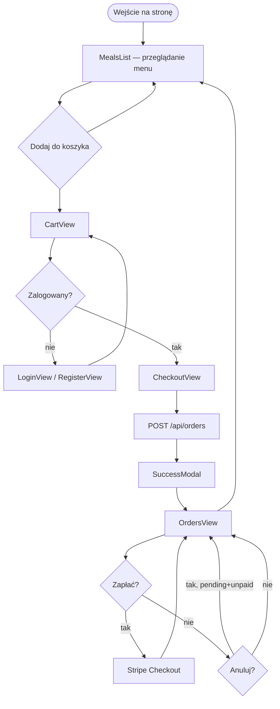

# Ścieżka użytkownika

## Ekrany użytkownika

| Ekran (`VIEWS`)        | Dostęp     | Akcje                                  |
| ---------------------- | ---------- | -------------------------------------- |
| domyślny (`MealsList`) | publiczny  | przeglądanie, dodawanie do koszyka     |
| `CART`                 | publiczny  | edycja ilości, przejście do kasy       |
| `LOGIN` / `REGISTER`   | publiczny  | auth                                   |
| `CHECKOUT`             | zalogowany | formularz dostawy, złożenie zamówienia |
| `ORDERS`               | zalogowany | lista zamówień, płatność, anulowanie   |

## Dane w localStorage

| Klucz   | Zawartość                         |
| ------- | --------------------------------- |
| `token` | JWT                               |
| `user`  | `{ id, email, name, role }`       |
| `cart`  | `[{ id, name, price, quantity }]` |

Logout czyści `token`, `user` i `cart`.
