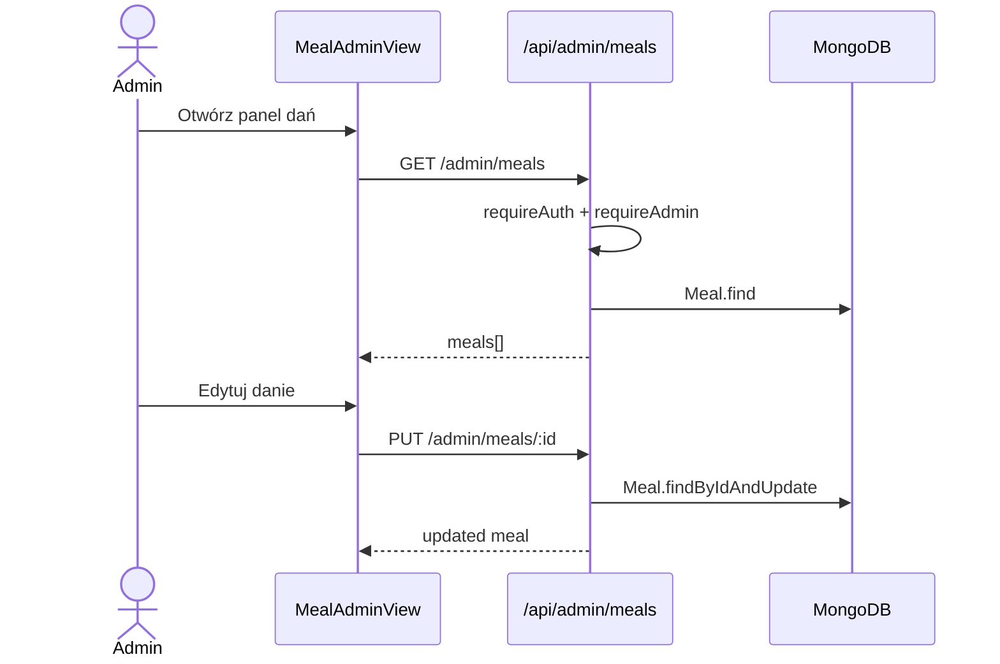
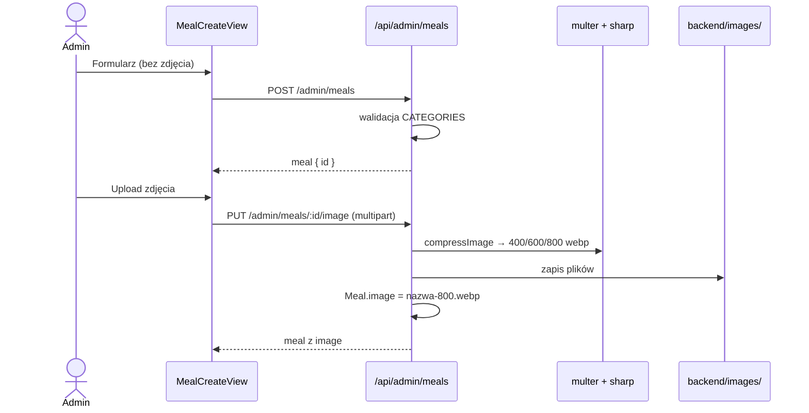
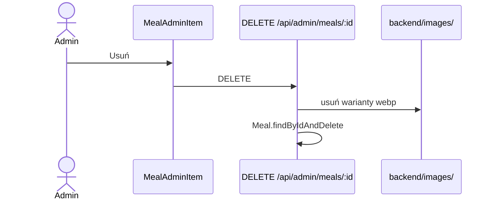
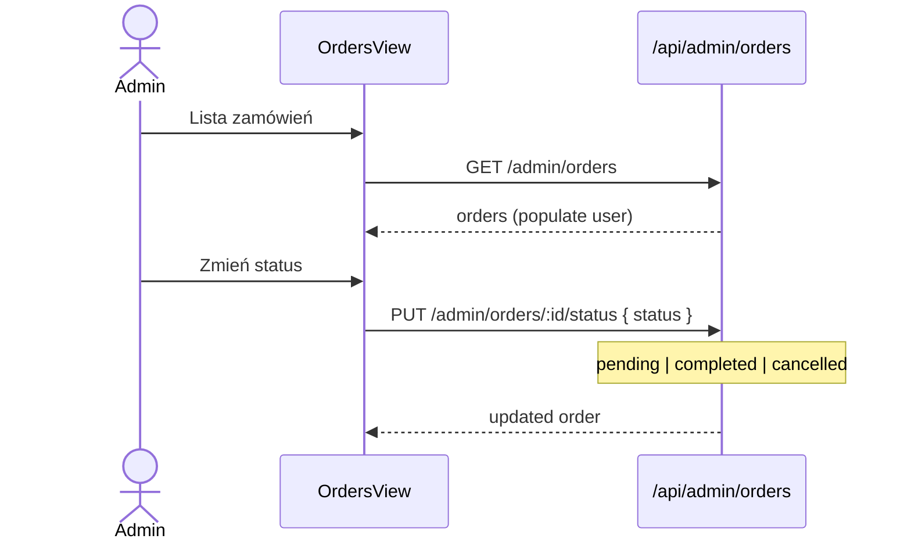

# Sekwencja: admin CRUD dań

## Lista i edycja

## Tworzenie dania (dwa kroki)

## Usuwanie

## Zarządzanie zamówieniami (admin)

Admin nie zmienia `paymentStatus` — robi to wyłącznie Stripe webhook.
