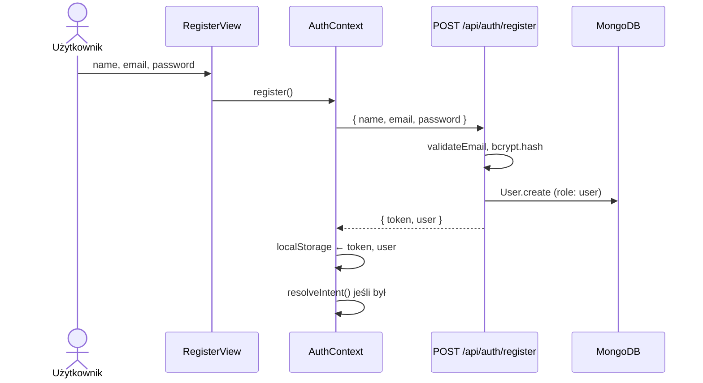
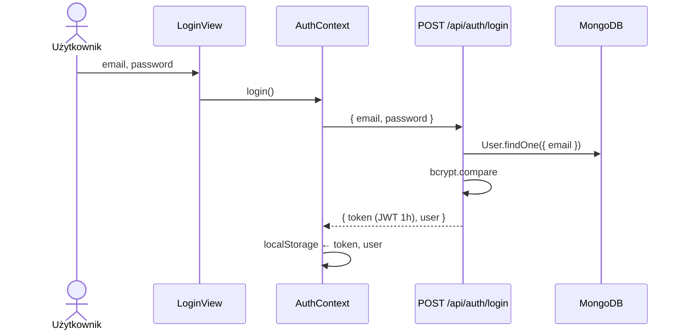
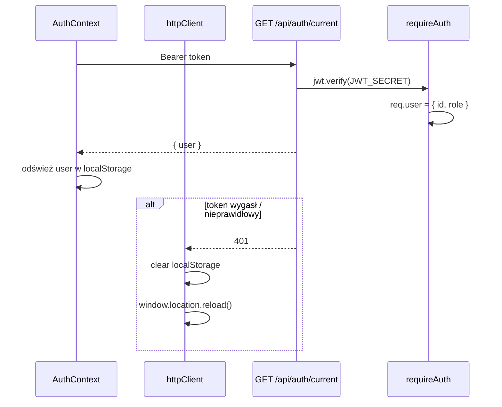

# Sekwencja: Uwierzytelnianie

## Rejestracja



## Logowanie



## Weryfikacja sesji (każde odświeżenie)



## JWT payload

```json
{ "id": "<userId>", "role": "user" | "admin" }
```

Ważność: **1 godzina**.

## Intent-based navigation

Gdy checkout wymaga logowania, `ViewContext.openWithIntent(LOGIN, CART)` otwiera login i po sukcesie `resolveIntent()` wraca do koszyka.
