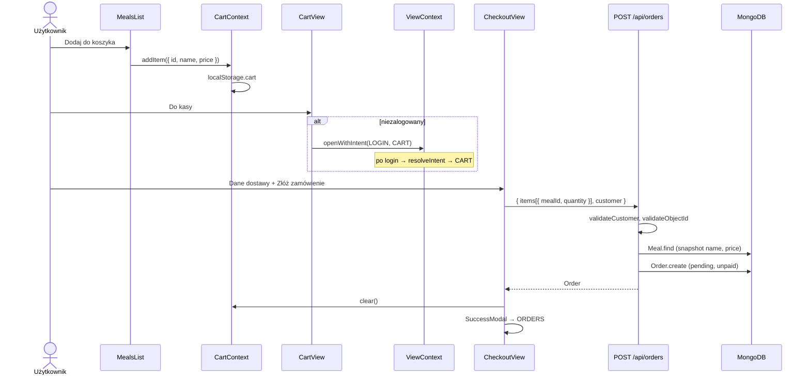

# Sekwencja: składanie zamówienia

## Co robi backend przy `createOrder`

1. Waliduje `customer` (name, email, street, postalCode, city).
2. Pobiera `Meal` po `mealId` — odrzuca nieistniejące.
3. Liczy `totalPrice`, kopiuje `name` i `price` do `items[]`.
4. Zapisuje `Order` z `status: pending`, `paymentStatus: unpaid`.

Koszyk po stronie klienta nie jest weryfikowany cenowo — backend bierze aktualne ceny z bazy danych
