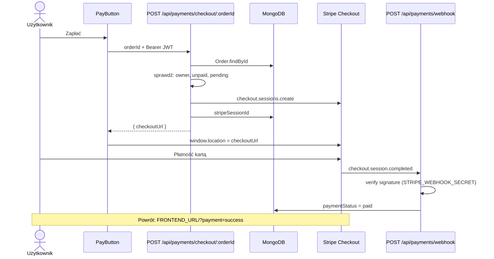
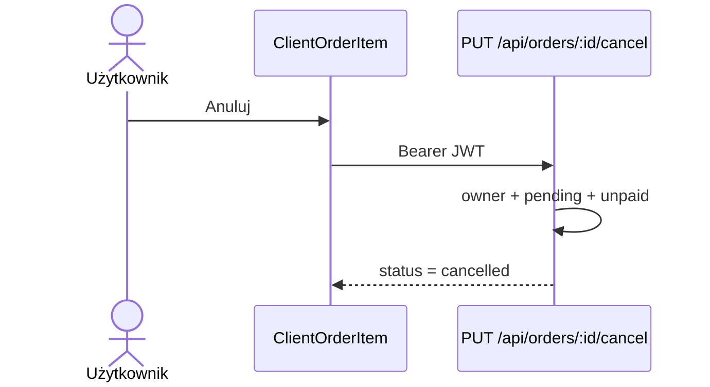

# Sekwencja: płatność Stripe

## Webhook — obsługiwane zdarzenia

| Zdarzenie                       | Zmiana w Order                                        |
| ------------------------------- | ----------------------------------------------------- |
| `checkout.session.completed`    | `paymentStatus → paid`, zapis `stripePaymentIntentId` |
| `checkout.session.expired`      | `paymentStatus → expired`, `status → cancelled`       |
| `charge.refunded`               | `paymentStatus → refunded`                            |
| `payment_intent.payment_failed` | tylko `console.warn` — brak zmiany w DB               |

## Ważne

- Webhook montowany **przed** `express.json()` — wymaga raw body.
- Aktualizacje idempotentne: np. `paid` tylko gdy `paymentStatus === 'unpaid'`.
- Bez `STRIPE_SECRET_KEY` endpoint checkout zwraca **503**.

## Anulowanie przez użytkownika

Szczegóły stanów: [order-states.md](../../architecture/order-states.md).
